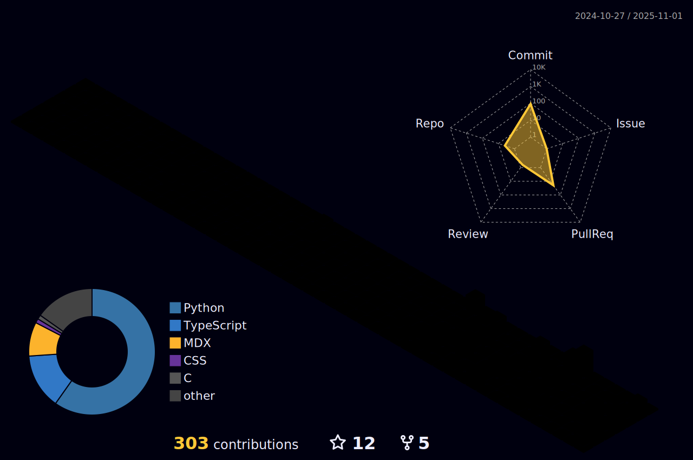

### Hi there 👋

<!--
Ha! You found my GitHub profile! Here is your easter egg 🥚: https://bit.ly/4nska3o 
-->

I'm Minh, I graduated from **Hanoi University of Science and Technology (HUST)** in 2022. Between then and now, I've navigated two very different high-stakes environments: developing enterprise microservices in the Banking sector and serving as a Cryptologist and Squad Leader in the Vietnam People's Navy.

Today, I focus on building distributed systems and resilient banking software, primarily using Java and Python.

[CV](https://minhdqdev.github.io/cv/) | [LeetCode](https://leetcode.com/u/minhdq99hp/) | [Personal Blog](https://minhdq.dev) | [Buy me a coffee](https://www.buymeacoffee.com/minhdq99hp).

---

  &nbsp;
  &nbsp;
  &nbsp;
  

